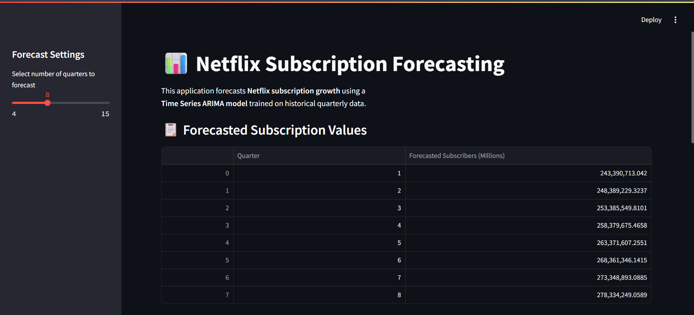

# 📊 Netflix Subscription Forecasting using Time Series Analysis
## 📌 Project Overview

This project focuses on forecasting Netflix’s future subscription growth using historical time series data. By applying statistical and machine learning-based forecasting techniques, the project aims to provide business-ready insights that help anticipate user growth trends and support strategic decision-making.

The solution is implemented using an ARIMA (AutoRegressive Integrated Moving Average) model and deployed through an interactive Streamlit dashboard for easy visualization and exploration of future forecasts.

## 🎯 Problem Statement

Netflix relies on understanding future subscriber growth to make informed decisions about content investment, infrastructure scaling, and market expansion. However, raw historical data does not provide predictive insight into future trends.

This project solves that problem by building a forecasting model that predicts Netflix’s subscription growth over upcoming quarters based on historical patterns.

## 🧠 Solution Approach

The project uses a complete machine learning pipeline:

Clean and preprocess time series subscription data

Perform exploratory time series analysis to identify trends and seasonality

Apply stationarity tests and differencing

Train an ARIMA model for forecasting

Evaluate the model using error metrics

Deploy the model through a Streamlit application

## 📊 Dataset

The dataset contains Netflix subscription data with the following columns:

Time Period (Date)

Subscribers (in millions)

The data is aggregated to a quarterly frequency for forecasting.

## 🛠 Technologies Used

Python

Pandas, NumPy

Plotly, Matplotlib

Statsmodels (ARIMA)

Streamlit

Joblib

## 📈 Model Used

ARIMA (AutoRegressive Integrated Moving Average) was used for forecasting because it:

Captures temporal dependencies

Handles trend using differencing

Models residual patterns using moving averages

The model was trained on quarterly Netflix subscription data to predict future subscriber growth.

## 📉 Model Evaluation

The forecasting model was evaluated using:

RMSE (Root Mean Squared Error)

MAE (Mean Absolute Error)

These metrics ensure that the predicted subscription values closely follow historical trends.

## 🖥 Application Interface

An interactive Streamlit dashboard allows users to:

Select how many future quarters to forecast

# Stream lit Dashboard

